# CI/CD Pipeline Analysis & Recommendations

## Current CI/CD Flow

### Phase 1: CI Workflow (`ci.yml`)
**Trigger**: Every push to main, PRs to main

```mermaid
graph TD
    A[Push/PR] --> B[Fast Checks: Parallel]
    B --> C1[TypeScript]
    B --> C2[ESLint]
    B --> C3[Unit Tests]
    B --> C4[Security Rules Tests]
    C1 --> D{All Pass?}
    C2 --> D
    C3 --> D
    C4 --> D
    D -->|Yes| E[E2E Tests with Emulators]
    D -->|Yes| F[Performance Tests]
    D -->|No| G[❌ Block]
    E --> H{Complete?}
    F --> H
    H -->|Success| I[✅ CI Complete]
    H -->|Failure| G
```



**Environment**: Local with Firebase Emulators
**Duration**: ~7-13 minutes
**Viewport**: Desktop Chrome only

### Phase 2: Deploy & Test Workflow (`deploy-and-test.yml`)
**Trigger**: After CI completes successfully OR directly on push

```mermaid
graph TD
    A[CI Complete ✅] --> B[Deploy to Vercel Staging]
    B --> C[E2E on Real Staging]
    C -->|Pass| D[Deploy to Production]
    C -->|Fail| E[❌ Block Production]
    D --> F[Smoke Test Production]
    F -->|Fail| G[⚠️ Log Warning]
    F -->|Pass| H[✅ Complete]
```



**Environment**: Real Vercel deployments with Firebase staging/production
**Duration**: ~12-18 minutes (if CI already passed)
**Viewport**: Desktop Chrome only

## Gap Analysis

### 1. Mobile RTL Testing ❌

**Current State**:
- All tests run ONLY on `Desktop Chrome` viewport
- RTL (Hebrew) is primarily used on mobile devices
- No mobile viewport testing at all

**Impact**:
- Mobile-specific RTL layout issues not caught
- Responsive design bugs not detected
- Touch interactions not tested

**Evidence**:
```typescript
// playwright.config.ts - All projects use Desktop Chrome
{
  name: 'staging',
  use: {
    ...devices['Desktop Chrome'],  // ❌ No mobile
    baseURL: FIREBASE_TEST_URL,
  },
}
```

### 2. RTL Coverage ⚠️

**Current State**:
- Basic RTL test exists in `e2e/i18n.spec.ts`
- Test is weak: `|| true` always passes
- No specific equipment page RTL tests
- No visual regression testing

**Current RTL Test**:
```typescript
test('[I18N-2] should have RTL compatibility for Hebrew', async ({ page }) => {
  // ...
  // ❌ This || true means test always passes!
  expect(htmlDir === 'rtl' || bodyDir === 'rtl' || hasRtlClass || true).toBeTruthy();
});
```

### 3. Workflow Efficiency ⚠️

**Current State**:
- Two workflows can run in parallel (wasteful if CI fails)
- `deploy-and-test.yml` has both `push` trigger AND `workflow_run` trigger
- Duplication of effort

**Issue**:
```yaml
on:
  push:                    # ❌ Runs immediately
    branches: [main]
  workflow_run:            # ✅ Should wait for CI
    workflows: ["CI"]
```

This means `deploy-and-test.yml` runs TWICE:
1. Once on push (parallel with CI)
2. Once after CI completes

### 4. Test Environment Mismatch ⚠️

**Current State**:
- CI E2E uses localhost + emulators
- Deploy workflow E2E uses real Vercel + staging Firebase
- Different environments may have different bugs

**Example**: The newline bug in `VITE_FIREBASE_PROJECT_ID` only appeared in Vercel environment

## Recommended Improvements

### Priority 1: Add Mobile Testing (Critical)

```typescript
// playwright.config.ts
projects: [
  // Desktop tests (existing)
  { name: 'chromium', use: { ...devices['Desktop Chrome'] } },

  // NEW: Mobile tests
  {
    name: 'mobile-chrome',
    use: {
      ...devices['Pixel 5'],  // Android mobile viewport
    },
  },
  {
    name: 'mobile-safari',
    use: {
      ...devices['iPhone 13'],  // iOS mobile viewport
    },
  },

  // Staging mobile
  {
    name: 'staging-mobile',
    use: {
      ...devices['Pixel 5'],
      baseURL: FIREBASE_TEST_URL,
    },
  },
]
```

### Priority 2: Improve RTL Testing

Create dedicated RTL test suite:

```typescript
// e2e/rtl.spec.ts
test.describe('RTL Layout [Hebrew]', () => {
  test.beforeEach(async ({ page }) => {
    await loginAsTestUser(page, 'admin');
    await page.goto('/equipment');
    // Switch to Hebrew if not default
    // await switchLanguage(page, 'he');
  });

  test('[RTL-1] Equipment page title should align right', async ({ page }) => {
    const title = page.locator('h1').first();
    const titleBox = await title.boundingBox();
    const parentBox = await title.locator('..').boundingBox();

    // Title should be on the right side of parent
    expect(titleBox.x + titleBox.width).toBeCloseTo(
      parentBox.x + parentBox.width,
      10
    );
  });

  test('[RTL-2] Search input should have RTL text direction', async ({ page }) => {
    const searchInput = page.getByPlaceholder(/חיפוש|search/i);
    const direction = await searchInput.evaluate(el =>
      window.getComputedStyle(el).direction
    );
    expect(direction).toBe('rtl');
  });

  test('[RTL-3] Tabs should flow right to left', async ({ page }) => {
    const tabs = page.locator('[role="tablist"]');
    const direction = await tabs.evaluate(el =>
      window.getComputedStyle(el).direction
    );
    expect(direction).toBe('rtl');
  });

  // Visual regression
  test('[RTL-4] Equipment page visual snapshot (mobile)', async ({ page }) => {
    await expect(page).toHaveScreenshot('equipment-rtl-mobile.png', {
      fullPage: true,
    });
  });
});
```

### Priority 3: Fix Workflow Triggers

Remove duplicate triggers:

```yaml
# deploy-and-test.yml
on:
  # ❌ Remove: push trigger (causes duplicate runs)
  # push:
  #   branches: [main]

  # ✅ Keep: Only run after CI succeeds
  workflow_run:
    workflows: ["CI"]
    types:
      - completed
    branches: [main]

  # ✅ Keep: Manual testing via PRs
  pull_request:
    branches: [main]
```

### Priority 4: Add RTL-specific Lint Rules

```json
// .eslintrc.js
rules: {
  // Warn about directional CSS that might break RTL
  'no-restricted-syntax': [
    'warn',
    {
      selector: 'Literal[value=/margin-left|margin-right|padding-left|padding-right|left|right/]',
      message: 'Use logical properties (margin-inline-start, padding-inline-end) for RTL support'
    }
  ]
}
```

### Priority 5: Add Environment Parity Check

Create a smoke test that runs on both emulator and staging to catch environment-specific issues:

```typescript
// e2e/environment-parity.spec.ts
test.describe('Environment Parity', () => {
  test('[ENV-1] Firebase config should not have newlines', async ({ page }) => {
    const config = await page.evaluate(() => {
      return JSON.stringify(window.__FIREBASE_CONFIG__ || {});
    });

    expect(config).not.toContain('%0A');
    expect(config).not.toContain('\\n');
  });

  test('[ENV-2] Test users should exist', async ({ page }) => {
    await page.goto('/auth');
    const testModeSection = page.locator('text=/test mode/i');
    await expect(testModeSection).toBeVisible();
  });
});
```

## Implementation Plan

### Phase 1 (Immediate - 1 day)
1. Fix workflow duplicate triggers
2. Add mobile viewport to staging tests
3. Strengthen existing RTL test (remove `|| true`)

### Phase 2 (Short-term - 2-3 days)
4. Create comprehensive RTL test suite
5. Add mobile Chrome and Safari projects
6. Add visual regression testing for RTL

### Phase 3 (Medium-term - 1 week)
7. Add RTL-specific ESLint rules
8. Add environment parity tests
9. Add performance budgets for mobile

## Metrics & Monitoring

### Current Coverage
- ✅ TypeScript: 100% (all code type-checked)
- ✅ Linting: 100% (all code linted)
- ✅ Unit: ~80% (estimate based on test files)
- ✅ Security Rules: 100% (all rules tested)
- ✅ E2E Desktop: ~70% (11 spec files)
- ❌ E2E Mobile: 0%
- ⚠️  RTL: ~20% (basic test, always passes)
- ❌ Visual Regression: 0%

### Target Coverage
- ✅ TypeScript: 100%
- ✅ Linting: 100%
- ✅ Unit: 80%+
- ✅ Security Rules: 100%
- ✅ E2E Desktop: 70%+
- 🎯 E2E Mobile: 50%+ (critical paths)
- 🎯 RTL: 80%+ (all major pages)
- 🎯 Visual Regression: 30%+ (critical pages)

## Questions & Decisions

1. **Should we run mobile tests on every push or only on staging?**
   - Recommendation: Run on staging only (faster CI, catches issues before prod)

2. **Which mobile devices should we support?**
   - Recommendation: Pixel 5 (Android) and iPhone 13 (iOS) for maximum coverage

3. **Should RTL tests run on desktop or mobile?**
   - Recommendation: Both, but prioritize mobile (where most Hebrew users are)

4. **Should we add visual regression testing?**
   - Recommendation: Yes, but start small (3-5 critical pages) to avoid flakiness

5. **Should we block deployment on visual regression failures?**
   - Recommendation: No, make it a warning (too many false positives initially)
