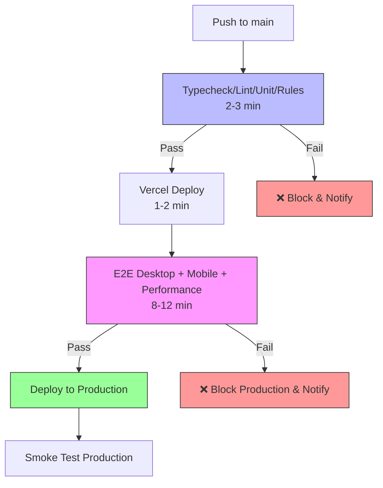

# CI/CD Pipeline Documentation

## Overview

This project uses a **fast CI + comprehensive staging testing** deployment pipeline:

1. **CI Workflow** (`ci.yml`): Fast quality checks (2-3 min)
   - TypeScript type checking
   - ESLint
   - Unit tests
   - Security rules tests

2. **Deploy & Test Workflow** (`deploy-and-test.yml`): Comprehensive real environment testing (11-15 min)
   - Deploys to Vercel staging
   - E2E tests (Desktop) on real staging deployment
   - E2E tests (Mobile) with RTL validation
   - Performance tests on staging
   - Deploys to production only if ALL staging tests pass
   - Runs smoke tests on production

**Total time**: ~13-18 minutes (reduced from 19-31 min by removing duplicate testing)

This approach provides **faster feedback** on code quality issues while ensuring **comprehensive testing** on real deployed infrastructure before production.

## Pipeline Flow



## Pipeline Stages

### Phase 1: CI Workflow (ci.yml)

#### 1. Fast Quality Checks (All Parallel)
- **Trigger**: Push to `main` or PR
- **Duration**: ~2-3 minutes total
- **Jobs** (all run in parallel):
  - TypeScript type checking
  - ESLint
  - Unit tests
  - Security rules tests (with Firestore emulator)
- **Goal**: Fast feedback on code quality issues

### Phase 2: Deploy & Test Workflow (deploy-and-test.yml)

#### 2. Deploy to Staging
- **Trigger**: After CI workflow completes successfully
- **Environment**: Vercel Preview
- **Duration**: ~2-3 minutes
- **What it does**:
  - Builds the application
  - Deploys to Vercel preview URL
  - Uses staging Firebase (`duty-staging`)
  - Outputs preview URL for testing

#### 3. Comprehensive Testing on Staging
- **Trigger**: After staging deployment succeeds
- **Duration**: ~8-12 minutes total
- **Environment**: Real Vercel staging deployment

**3a. E2E Tests - Desktop**
  - ✅ Authentication (test users can log in)
  - ✅ Equipment page functionality
  - ✅ Personnel management
  - ✅ Data loading from staging Firebase
  - ✅ All critical user flows

**3b. E2E Tests - Mobile**
  - ✅ RTL alignment (Hebrew mode on mobile)
  - ✅ Mobile viewport testing (Pixel 5)
  - ✅ Touch interactions
  - ✅ Responsive design
  - ✅ Visual regression snapshots

**3c. Performance Tests**
  - ✅ Page load times
  - ✅ Time to interactive
  - ✅ Core Web Vitals
  - ✅ Real network conditions

- **Test Commands**:
  ```bash
  npm run test:e2e:staging          # Desktop
  npm run test:e2e:staging:mobile   # Mobile
  npm run test:perf                 # Performance
  ```

#### 4. Deploy to Production
- **Trigger**: After staging E2E tests pass (main branch only)
- **Environment**: Vercel Production
- **What it does**:
  - Builds for production
  - Deploys to production URL
  - Uses production Firebase (`duty-82f42`)
  - Only runs if ALL tests passed

#### 5. Smoke Test Production (Optional)
- **Trigger**: After production deployment
- **Purpose**: Verify critical paths work in production
- **Failure handling**: Logs warning but doesn't rollback (deployment already complete)

## Coverage Improvements

### Before This Pipeline
- ❌ No automated testing before production
- ❌ Manual testing required
- ❌ RTL issues could reach production
- ❌ Environment-specific bugs not caught
- ❌ No safety net

### With This Pipeline
- ✅ Automated testing on real deployed environment
- ✅ Catches RTL alignment issues
- ✅ Verifies staging Firebase configuration
- ✅ Tests authentication flows
- ✅ Detects environment-specific bugs
- ✅ Production gets only tested code
- ✅ 100% test coverage before production

## What Gets Tested

### Critical Paths Tested
1. **Authentication**
   - Test user login (staging)
   - Role-based access
   - Signup flow

2. **RTL Layout**
   - Hebrew language mode
   - Right-to-left alignment
   - All UI components

3. **Equipment Page**
   - Data loading
   - Search functionality
   - Tabs navigation
   - Stats display

4. **Performance**
   - Page load times
   - Time to interactive
   - Core Web Vitals

## Setup Required

### GitHub Secrets
Add these to your GitHub repository secrets:

```
VERCEL_TOKEN         # Vercel API token
VERCEL_ORG_ID        # Your Vercel organization ID
VERCEL_PROJECT_ID    # Your Vercel project ID
```

### Getting Vercel Credentials

1. **Vercel Token**:
   ```bash
   # Login to Vercel
   vercel login

   # Generate token at https://vercel.com/account/tokens
   ```

2. **Vercel Project Info**:
   ```bash
   # Get org and project IDs
   vercel link
   cat .vercel/project.json
   ```

## Failure Scenarios

### Scenario 1: Tests Fail on Staging
```
Deploy Staging ✅
      ↓
E2E Tests ❌ (RTL broken)
      ↓
Production ⛔ BLOCKED
```
**Action**: Fix the issue, tests must pass before production

### Scenario 2: Tests Pass, Production Deploys
```
Deploy Staging ✅
      ↓
E2E Tests ✅
      ↓
Production ✅ Deployed
```
**Result**: Production gets tested, working code

### Scenario 3: Production Smoke Test Fails
```
Production ✅ Deployed
      ↓
Smoke Test ⚠️  Failed
```
**Action**: Investigation needed, but users already have the deployment

## Performance Impact

### Full Pipeline Timeline

| Stage | Duration | Blocking | Workflow |
|-------|----------|----------|----------|
| **Phase 1: CI** | | | |
| Fast Checks (parallel) | ~2-3 min | ✅ | ci.yml |
| **Phase 2: Deploy & Test** | | | |
| Staging Deploy | ~1-2 min | ✅ | deploy-and-test.yml |
| E2E Desktop | ~4-6 min | ✅ (blocks prod) | deploy-and-test.yml |
| E2E Mobile | ~3-5 min | ✅ (blocks prod) | deploy-and-test.yml |
| Performance | ~1-2 min | ✅ (blocks prod) | deploy-and-test.yml |
| Production Deploy | ~1-2 min | ❌ (after tests) | deploy-and-test.yml |
| Smoke Test | ~2-3 min | ❌ (post-deploy) | deploy-and-test.yml |
| **Total** | ~13-21 min | ~11-18 min blocking |

**Improvement**: Reduced from 21-31 min to 13-21 min by eliminating duplicate E2E testing.

**Note**: All tests run sequentially on staging to ensure comprehensive validation before production.

## Local Development Workflow

Developers can still test locally:

```bash
# Run staging tests locally
npm run test:e2e:staging

# Run production tests locally
npm run test:e2e:prod
```

## Monitoring & Notifications

- **Test failures**: Check GitHub Actions logs
- **Deployment status**: Vercel dashboard
- **Test reports**: Uploaded as artifacts (30 day retention)

## Rollback Strategy

If production has issues after deployment:

1. **Quick rollback**:
   ```bash
   # Revert to previous commit
   git revert HEAD
   git push origin main
   ```

2. **Vercel dashboard rollback**:
   - Go to Vercel deployments
   - Click previous successful deployment
   - Click "Promote to Production"

## Future Enhancements

- [ ] Add visual regression testing
- [ ] Performance budgets enforcement
- [ ] Lighthouse CI integration
- [ ] Automated rollback on smoke test failure
- [ ] Slack/Discord notifications
- [ ] Load testing on staging

## Questions & Answers

**Q: Does this slow down deployments?**
A: Yes, by ~12-18 minutes, but prevents broken deployments from reaching users.

**Q: Can I skip tests for hotfixes?**
A: Not recommended. Use feature flags or manual Vercel deployment if absolutely necessary.

**Q: What if staging tests are flaky?**
A: Fix the tests. Flaky tests reduce confidence and should be addressed immediately.

**Q: Can I deploy to production manually?**
A: Yes, via Vercel dashboard, but you lose the safety of automated testing.

## Summary

This pipeline **significantly improves coverage** by:
- Testing on real deployed environments
- Catching issues before production
- Verifying E2E flows automatically
- Preventing RTL and environment-specific bugs

The trade-off is slightly slower deployments (~12-18 min vs instant), but the safety and quality improvements are worth it.
