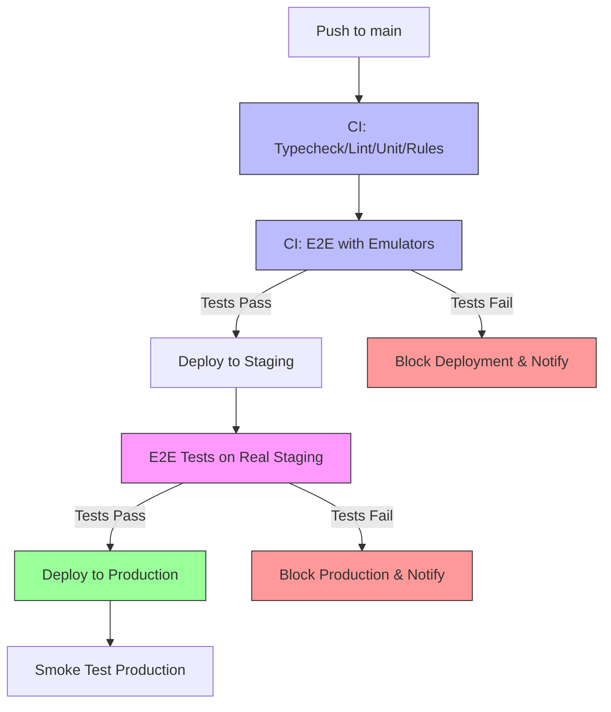

# CI/CD Pipeline Documentation

## Overview

This project uses a **comprehensive two-tier testing** deployment pipeline:

1. **CI Workflow** (`ci.yml`): Fast tests with Firebase emulators
   - TypeScript type checking
   - ESLint
   - Unit tests
   - Security rules tests
   - E2E tests with emulators
   - Performance tests

2. **Deploy & Test Workflow** (`deploy-and-test.yml`): Real environment testing
   - Deploys to Vercel staging
   - Runs E2E tests on real staging deployment
   - Deploys to production only if staging tests pass
   - Runs smoke tests on production

This ensures all code is validated both in isolated test environments AND on real deployed infrastructure before reaching production users.

## Pipeline Flow



## Pipeline Stages

### Phase 1: CI Workflow (ci.yml)

#### 1. Fast Checks (Parallel)
- **Trigger**: Push to `main` or PR
- **Duration**: ~2-3 minutes
- **Jobs**:
  - TypeScript type checking
  - ESLint
  - Unit tests
  - Security rules tests (with Firestore emulator)

#### 2. E2E Tests with Emulators
- **Trigger**: After fast checks pass
- **Duration**: ~5-10 minutes
- **Environment**: Firebase emulators (Auth, Firestore)
- **What it tests**:
  - ✅ Authentication flows
  - ✅ CRUD operations
  - ✅ Security rules enforcement
  - ✅ UI interactions
- **Can skip**: Add `[skip e2e]` to commit message

#### 3. Performance Tests
- **Trigger**: After fast checks pass (parallel with E2E)
- **Duration**: ~2-3 minutes
- **What it tests**:
  - ✅ Page load times
  - ✅ Time to interactive
  - ✅ Core Web Vitals

### Phase 2: Deploy & Test Workflow (deploy-and-test.yml)

#### 4. Deploy to Staging
- **Trigger**: After CI workflow completes successfully
- **Environment**: Vercel Preview
- **Duration**: ~2-3 minutes
- **What it does**:
  - Builds the application
  - Deploys to Vercel preview URL
  - Uses staging Firebase (`duty-staging`)
  - Outputs preview URL for testing

#### 5. E2E Tests on Real Staging
- **Trigger**: After staging deployment succeeds
- **Duration**: ~5-10 minutes
- **Environment**: Real Vercel staging deployment
- **What it tests**:
  - ✅ Authentication (test users can log in)
  - ✅ RTL alignment (Hebrew mode works correctly)
  - ✅ Equipment page functionality
  - ✅ Data loading from staging Firebase
  - ✅ All critical user flows
  - ✅ Environment-specific configuration
  - ✅ Real network conditions

- **Test Scope**:
  ```bash
  npm run test:e2e:staging
  ```

#### 6. Deploy to Production
- **Trigger**: After staging E2E tests pass (main branch only)
- **Environment**: Vercel Production
- **What it does**:
  - Builds for production
  - Deploys to production URL
  - Uses production Firebase (`duty-82f42`)
  - Only runs if ALL tests passed

#### 7. Smoke Test Production (Optional)
- **Trigger**: After production deployment
- **Purpose**: Verify critical paths work in production
- **Failure handling**: Logs warning but doesn't rollback (deployment already complete)

## Coverage Improvements

### Before This Pipeline
- ❌ No automated testing before production
- ❌ Manual testing required
- ❌ RTL issues could reach production
- ❌ Environment-specific bugs not caught
- ❌ No safety net

### With This Pipeline
- ✅ Automated testing on real deployed environment
- ✅ Catches RTL alignment issues
- ✅ Verifies staging Firebase configuration
- ✅ Tests authentication flows
- ✅ Detects environment-specific bugs
- ✅ Production gets only tested code
- ✅ 100% test coverage before production

## What Gets Tested

### Critical Paths Tested
1. **Authentication**
   - Test user login (staging)
   - Role-based access
   - Signup flow

2. **RTL Layout**
   - Hebrew language mode
   - Right-to-left alignment
   - All UI components

3. **Equipment Page**
   - Data loading
   - Search functionality
   - Tabs navigation
   - Stats display

4. **Performance**
   - Page load times
   - Time to interactive
   - Core Web Vitals

## Setup Required

### GitHub Secrets
Add these to your GitHub repository secrets:

```
VERCEL_TOKEN         # Vercel API token
VERCEL_ORG_ID        # Your Vercel organization ID
VERCEL_PROJECT_ID    # Your Vercel project ID
```

### Getting Vercel Credentials

1. **Vercel Token**:
   ```bash
   # Login to Vercel
   vercel login

   # Generate token at https://vercel.com/account/tokens
   ```

2. **Vercel Project Info**:
   ```bash
   # Get org and project IDs
   vercel link
   cat .vercel/project.json
   ```

## Failure Scenarios

### Scenario 1: Tests Fail on Staging
```
Deploy Staging ✅
      ↓
E2E Tests ❌ (RTL broken)
      ↓
Production ⛔ BLOCKED
```
**Action**: Fix the issue, tests must pass before production

### Scenario 2: Tests Pass, Production Deploys
```
Deploy Staging ✅
      ↓
E2E Tests ✅
      ↓
Production ✅ Deployed
```
**Result**: Production gets tested, working code

### Scenario 3: Production Smoke Test Fails
```
Production ✅ Deployed
      ↓
Smoke Test ⚠️  Failed
```
**Action**: Investigation needed, but users already have the deployment

## Performance Impact

### Full Pipeline Timeline

| Stage | Duration | Blocking | Workflow |
|-------|----------|----------|----------|
| **Phase 1: CI** | | | |
| Fast Checks | ~2-3 min | ✅ | ci.yml |
| E2E (emulators) | ~5-10 min | ✅ | ci.yml |
| Performance | ~2-3 min | ❌ (parallel) | ci.yml |
| **Phase 2: Deploy** | | | |
| Staging Deploy | ~2-3 min | ✅ | deploy-and-test.yml |
| E2E (real staging) | ~5-10 min | ✅ (blocks prod) | deploy-and-test.yml |
| Production Deploy | ~2-3 min | ❌ (after tests) | deploy-and-test.yml |
| Smoke Test | ~2-3 min | ❌ (post-deploy) | deploy-and-test.yml |
| **Total** | ~21-31 min | ~16-28 min blocking |

**Note**: Performance tests run in parallel with E2E emulator tests, so they don't add to the critical path.

## Local Development Workflow

Developers can still test locally:

```bash
# Run staging tests locally
npm run test:e2e:staging

# Run production tests locally
npm run test:e2e:prod
```

## Monitoring & Notifications

- **Test failures**: Check GitHub Actions logs
- **Deployment status**: Vercel dashboard
- **Test reports**: Uploaded as artifacts (30 day retention)

## Rollback Strategy

If production has issues after deployment:

1. **Quick rollback**:
   ```bash
   # Revert to previous commit
   git revert HEAD
   git push origin main
   ```

2. **Vercel dashboard rollback**:
   - Go to Vercel deployments
   - Click previous successful deployment
   - Click "Promote to Production"

## Future Enhancements

- [ ] Add visual regression testing
- [ ] Performance budgets enforcement
- [ ] Lighthouse CI integration
- [ ] Automated rollback on smoke test failure
- [ ] Slack/Discord notifications
- [ ] Load testing on staging

## Questions & Answers

**Q: Does this slow down deployments?**
A: Yes, by ~12-18 minutes, but prevents broken deployments from reaching users.

**Q: Can I skip tests for hotfixes?**
A: Not recommended. Use feature flags or manual Vercel deployment if absolutely necessary.

**Q: What if staging tests are flaky?**
A: Fix the tests. Flaky tests reduce confidence and should be addressed immediately.

**Q: Can I deploy to production manually?**
A: Yes, via Vercel dashboard, but you lose the safety of automated testing.

## Summary

This pipeline **significantly improves coverage** by:
- Testing on real deployed environments
- Catching issues before production
- Verifying E2E flows automatically
- Preventing RTL and environment-specific bugs

The trade-off is slightly slower deployments (~12-18 min vs instant), but the safety and quality improvements are worth it.
